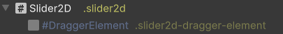

# VCustomControls

A collection of **UI Toolkit** custom controls where each one has a dedicated example. 🦖

## Slider2D
This component behaves like a Slider but in 2D.

### Hierarchy and Classes


### UxmlAttributes
``` csharp
public Vector2 MinValue
public Vector2 MaxValue
public Vector2 value
```
### Bindable properties
``` csharp
public Vector2 value
```