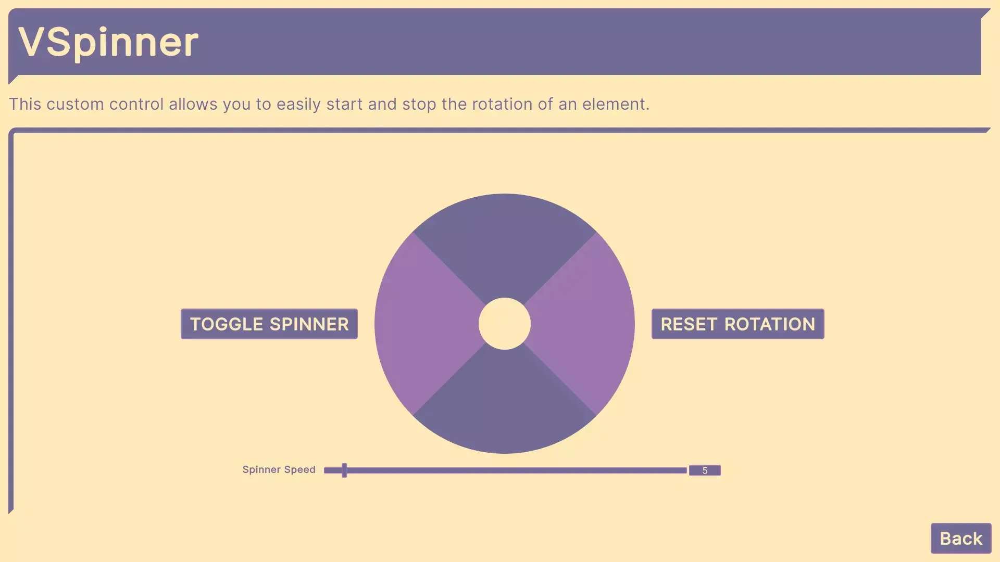

# VCustomControls
Collection of UI Toolkit custom controls.

- [Slider2D](#slider2d)
- [AnimatedSprite](#animatedsprite)
- [DropdownCustom & EnumDropdownCustom](#dropdowncustom--enumdropdowncustom)
- [GridListView](#gridlistview)
- [RadialMenu](#radialmenu)
- [RadialSlider](#radialslider)
- [Rotator](#rotator)
- [ScrollableLabel](#scrollablelabel)
- [ScrollViewAnimated](#scrollviewanimated)
- [ScrollViewInfinite](#scrollviewinfinite)
- [Spinner](#spinner)
- [Tooltip](#tooltip)
- [CustomEventPanel](#customeventpanel)
- [Custom events](#custom-events)
- [Custom manipulators](#custom-manipulators)

> [!IMPORTANT]
> The ScrollViewAnimated uses [DoTween](https://dotween.demigiant.com/).

## Slider2D
This custom component is a slider but in 2D.


The value property is compatible with [ChangeEvent](https://docs.unity3d.com/Manual/UIE-Change-Events.html).
#### UxmlAttributes
- ```public Vector2 MinValue```: Min value for "value".
- ```public Vector2 MaxValue```: Max value for "value".
- <ins>Bindable</ins> ```public Vector2 value```: The slider's value.
#### USS classes
- ```VSlider2DClass``` ("slider2d"): Class added to the slider2D.
- ```VDraggerClass``` (VSlider2DClass + "-dragger-element"): Class added to the dragger element.
#### Public methods
```public void SetValueWithoutNotify(Vector2 newValue)```: Sets value without triggering events.

## AnimatedSprite
This custom component allows to easily have a sprite animation. Assets used for the animation: [https://dani-maccari.itch.io/nuclear-leak-character-asset-pack](https://dani-maccari.itch.io/nuclear-leak-character-asset-pack).


The value property is compatible with [ChangeEvent](https://docs.unity3d.com/Manual/UIE-Change-Events.html).
#### UxmlAttributes
- <ins>Bindable</ins> ```public bool value```: This value is true when the animation is playing and false when it's not.
- ```public int FrameRate```: The frame rate used for the animated sprite.
- ```public int Loops```: Number of loops for the animation. Set to -1 for unlimited loops.
- ```public VSpriteAnimation SpriteAnimation```: Collection of Sprites used for the animated sprite.
#### USS classes
- ```VAnimatedSpriteClass``` ("animated-sprite"): Class added to the animatedSprite.
#### Public methods
- ```public void ResetAnimationIndex(int newAnimationIndex = 0)```: Resets the animation to the chosen index.
- ```public void ResetLoops()```: Sets the completed loops to 0.
- ```public void SetValueWithoutNotify(bool newValue)```: Sets value without triggering events. 

## AspectRatio
This custom component allows forcing the aspect ratio for its children.


#### UxmlAttributes
- <ins>Bindable</ins> ```public int RatioWidth```: Ratio forced for the width.
- <ins>Bindable</ins> ```public int RatioHeight```: Ratio forced for the height.
- ```public bool ApplyOnlyToWideScreen```: Determines whether the forced aspect ratio only applies for wide screens.
#### USS classes
- ```VAspectRatioClass``` ("aspect-ratio"): Class added to the aspectRatio.

## DropdownCustom & EnumDropdownCustom
This custom component allows to easily style the dropdown's list.


#### UxmlAttributes
- ```private string ClassToAdd```: Class added to the root of the dropdown's list.
- ```private string ScrollClassToAdd```: Class added to the ScrollView of the dropdown's list.

## GridListView
This custom component allows to have a listView with multiple columns.


#### UxmlAttributes
- The UxmlAttributes used for this component mimic the ones in the [ListView](https://docs.unity3d.com/6000.1/Documentation/ScriptReference/UIElements.ListView.html).
#### USS classes
- ```VGridListViewClass``` ("grid-list-view"): Class added to the gridListView.
- ```VGridRowClass``` ("grid-row"): Class added to the gridRow.
- ```VLastGridRowClass``` (GridRowClass + "-last"): Class added to the last gridRow.
#### Public methods
- ```public void BindToGrid(int[,] grid)```: Used to bind the data to the grid.

## RadialMenu
This custom component is a radial menu which is also compatible with keyboard and gamepad input.


The value property is compatible with [ChangeEvent](https://docs.unity3d.com/Manual/UIE-Change-Events.html).
#### UxmlAttributes
- <ins>Bindable</ins> ```public int value```: Determines the selected segment.
- ```public int Slots```: Number of segments.
- ```public float SlotImagePosition```: Determines the distance from the center for the images.
- ```public float AngleOffset```: Used to offset the angle to achieve a different look.
#### USS classes
- ```VRadialMenuClass``` ("radial-menu"): Class added to the radialMenu.
- ```VRadialMenuSubmittedClass``` (RadialMenuClass + "-submitted"): Class added to the radialMenu during the [NavigationSubmitEvent](https://docs.unity3d.com/6000.1/Documentation/ScriptReference/UIElements.NavigationSubmitEvent.html).
- ```VImageSlotClass``` ("image-slot"): Class added to all image slots.
- ```VImageSlotPosClass``` (ImageSlotClass + "-pos-"): Class added to the image slot. Example: "image-slot-pos-0" and "image-slot-pos-1".
#### Public methods
- ```public void SetValueWithoutNotify(int newValue)```: Sets value without triggering events.
#### Custom styles
- ```--radial-background-color```: Background color.
- ```--radial-border-color```: Border color.
- ```--radial-segment-color```: Selected segment color.
- ```--radial-border-width```: Border width.

## RadialSlider
This custom component is a radial slider which is also compatible with gamepad input.


The value property is compatible with [ChangeEvent](https://docs.unity3d.com/Manual/UIE-Change-Events.html).
#### UxmlAttributes
- ```public bool IsLoopable```: Whether the slider can wrap around instead of clamping at min/max.
- ```public bool IsInteractive```: Whether the user can interact with the slider.
- ```public float MinValue```: Min value for "value".
- ```public float MaxValue```: Max value for "value".
- <ins>Bindable</ins> ```public float value```: The slider's value.
- ```public float StartingAngle```: The angle, in degrees, where the slider’s range begins.
- ```public float EndingAngle```: The angle, in degrees, where the slider’s range ends.
- ```public Vector2 CenterOffset```: Used to offset the position of the radial slider.
- ```public LineCap BackgroundLineCap```: LineCap used for the background.
- ```public LineCap FillLineCap```: LineCap used for the fill.
- ```public LineCap DraggerLineCap```: LineCap used for the dragger.
- ```public float DraggerOffset1```: Distance from one side of the dragger to the center of the background.
- ```public float DraggerOffset2```: Distance from the other side of the dragger to the center of the background.
#### USS classes
- ```VRadialSliderClass``` ("radial-slider"): Class added the radialSlider.
#### Public methods
- ```public void SetValueWithoutNotify(float newValue)```: Sets value without triggering events.
#### Custom styles
- ```--radial-background-color```: Background color.
- ```--radial-fill-color```: Fill color.
- ```--radial-dragger-color```: Dragger color.
- ```--radial-background-width```: Background width.
- ```--radial-fill-width```: Fill width.
- ```--radial-dragger-width```: Dragger width.

## Rotator
This custom component allows to easily change a label's value from a set of options.


The value property is compatible with [ChangeEvent](https://docs.unity3d.com/Manual/UIE-Change-Events.html).
#### UxmlAttributes
- <ins>Bindable</ins> ```public int value```: The index of the chosen option.
- ```private bool HasButtons```: Whether the rotator has buttons.
- ```private bool AreButtonsLoopable```: Whether the options wrap.
#### USS classes
- ```VRotatorClass``` ("rotator"): Class added to the rotator.
#### Public methods
- ```public string GetCurrentOption()```: Returns the string of the chosen option.

## ScrollableLabel
This custom component allows to scroll a label when it does not fit in its container.


#### UxmlAttributes
- ```public string Text```: TextElement's text.
- ```public float ScrollSpeed```: The distance the text moves very ScrollRate ms.
- ```private long ScrollRate```: Time in ms between text movements.
- ```private bool IsLoopable```: Whether it continuously moves to the left.
- ```private bool IsAutomatic```: Whether the user can't interact with the text and it moves automatically.
- ```private long MsBetweenScrollsWhenAutomatic```: Waiting time between back and forward movement.
#### USS classes
- ```VScrollableLabelClass``` ("scrollable-label"): Class added to the scrollableLabel.
- ```VScrollableLabelContainerClass``` (ScrollableLabelClass + "-container"): Class added to the scrollableLabel's container.

## ScrollViewAnimated
This custom component allows to smoothly scroll to its children. 

> [!IMPORTANT]
> This custom component uses [DoTween](https://dotween.demigiant.com/).


#### UxmlAttributes
- ```public bool StopAnimationWhenScrolling```: Whether the user can stop the animated scrolling when they scroll.
- ```public float MinDistanceForMaxDuration```: Min distance needed for max duration. If the distance is smaller, the scrolling duration will be proportionally shorter.
#### USS classes
- ```VScrollViewAnimatedClass``` ("scroll-view-animated"): Class added to the scrollViewAnimated.
- ```VScrollViewAnimatedTargetClass``` (ScrollViewAnimatedClass + "-target"): Class added to the target during the animated scrolling.
#### Public methods
  - Smoothly scrolls to the selected element.
    ```
      public void AnimatedScrollTo(
      VisualElement element,
      float maxDuration,
      VAnimatedScrollType animatedScrollType = VAnimatedScrollType.Default,
      Ease ease = Ease.Linear)
    ```

## ScrollViewInfinite
This custom component allows to scroll infinitely.


#### USS classes
- ```VScrollViewInfiniteClass``` ("scroll-view-infinite"): Class added to the scrollViewInfinite.
- ```VScrollViewInfiniteItemClass``` (VScrollViewInfiniteClass + "-item"): Class added to each item in the scrollViewInfinite.

## Spinner
This custom component allows to easily rotate itself.



The value property is compatible with [ChangeEvent](https://docs.unity3d.com/Manual/UIE-Change-Events.html).
#### UxmlAttributes
- <ins>Bindable</ins> ```public bool value```: Whether the spinner is rotating.
- ```public float Speed```: Degrees that the spinner rotates every RotationRate ms.
- ```private long RotationRate```: Time in ms between each rotation change.
#### USS classes
- ```VSpinnerClass``` ("spinner"): Class added to the spinner.
#### Public methods
- ```public void SetValueWithoutNotify(bool newValue)```: Sets value without triggering events.
- ```public void ResetRotation()```: Resets the rotation angle to 0.

## Tooltip
This custom component allows to easily add runtime tooltips.


#### USS classes
- ```VTooltipClass``` ("tooltip"): Class added to the tooltip.
#### Public methods
- ```public void Show(VisualElement target, VTooltipPosition tooltipPosition, bool canHaveFadeDelay = true)```: Shows the tooltip.
- ```public void Hide()```: Hides the tooltip.
- ```public bool TryHide()```: Tries to hide the tooltip.
#### Custom styles
- ```--fade-duration-ms```: Fade duration.
- ```--tooltip-delay-ms```: Delay to start fading.
- ```--offset```: Distance between the tooltip and the target.
#### VTooltipManager
This class handles the logic to allow the tooltips to be global.
- ```public static bool TryGetTooltip(this IPanel panel, string tooltipClass, out VTooltip tooltip)```: Tries to get the tooltip with class "tooltipClass" in "panel".
- ```public static bool TryRegisterTooltip(this IPanel panel, string tooltipClass, out VTooltip tooltip)```: Tries to register a tooltip with class "tooltipClass" in "panel".
- ```public static bool TryUnregisterTooltip(this IPanel panel, string tooltipClass)```: Tries to unregister the tooltip with class "tooltipClass" in "panel".

## CustomEventPanel
This custom component allows to easily send custom events that should be sent after an input.

#### USS classes
- ```VCustomEventPanelClass``` ("custom-event-panel"): Class added to the customEventPanel.
#### VCustomEventManager
- public static bool TryGetInputActionUI(this IPanel panel, out VInputActionUI inputAction): Tries to get the VInputActionUI in "panel".
- public static bool TryRegisterInputActionUI(this IPanel panel, out VInputActionUI inputAction): Tries to register a VInputActionUI in "panel".
- public static bool TryUnregisterInputActionUI(this IPanel panel): Tries to unregister the VInputActionUI in "panel".

## Custom events
These events are related to input, check out the "VInputActionUI" Input Action Asset.

#### VAimEvent
Event used to get the direction of the right joystick.

#### VNavigationPostCancelEvent
Event used to get the release of the Cancel button.

#### VNavigationPostSubmitEvent
Event used to get the release of the Submit button.

## Custom manipulators
#### VExtendedClickable
Manipulator used to have access [PointerDownEvent](https://docs.unity3d.com/6000.1/Documentation/ScriptReference/UIElements.PointerDownEvent.html) while maintaining the :active pseudostate.
#### VTooltipManipulator
Manipulator used to associate a tooltip with a UI element.
